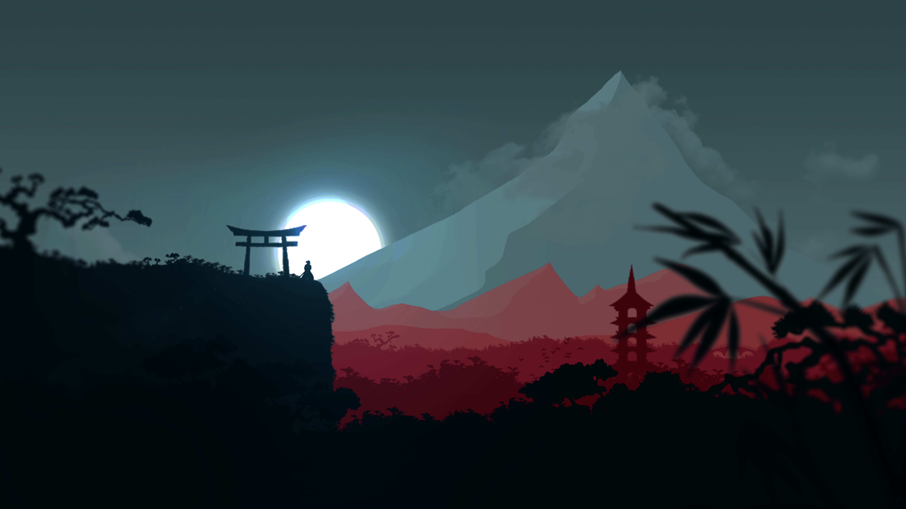

# Wallpapers
A collection of my wallpapers.
All images not in folders are original, unedited images.
Within [Upscayl](https://upscayl.org/), all images were upscaled using their software.
For convenience, images are provided for 2560x1440 and 7680x2560 resolutions. The latter being useful if you want to span ultra-wide displays.

### ArchLinux

### BeautifulSunset

### CitySkyline

### Coastline

### ColdForest

### CuteVillage

### CyberpunkSoldier

### GlowingArch

### GlowingKatana

### Hogwarts

### IguazaFalls

### IslandGetaway

### LichKing

### LijiangChina

### MajesticLion

### MountainLandscape

### MountainSide

### OrangeClouds

### PeacefulSea

### SamuraiSunset

### TakayamaJapan

### TheStorr

### TufaMonoLake

### WaterColourForest

### WhaleShark

### WindowsXP

